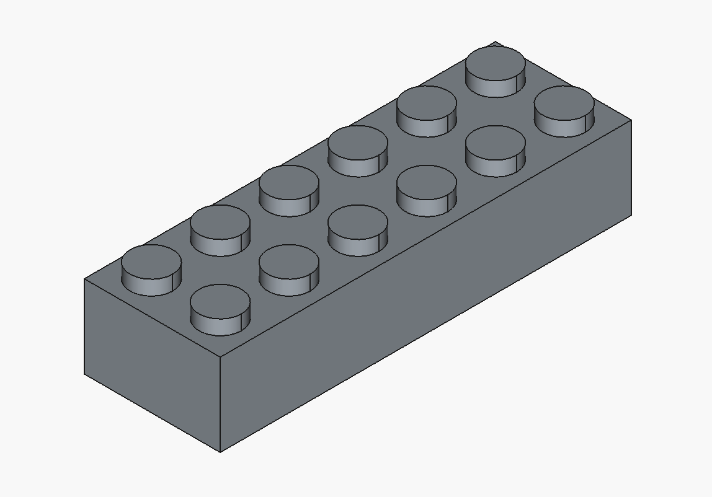
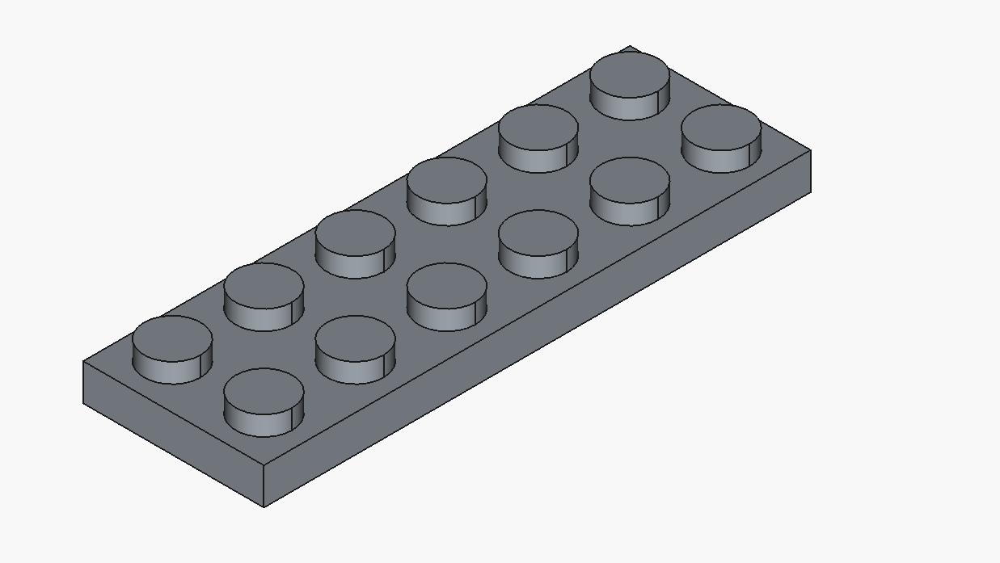
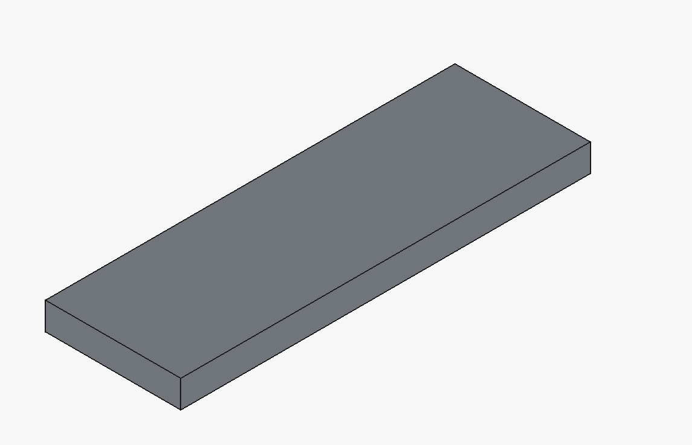
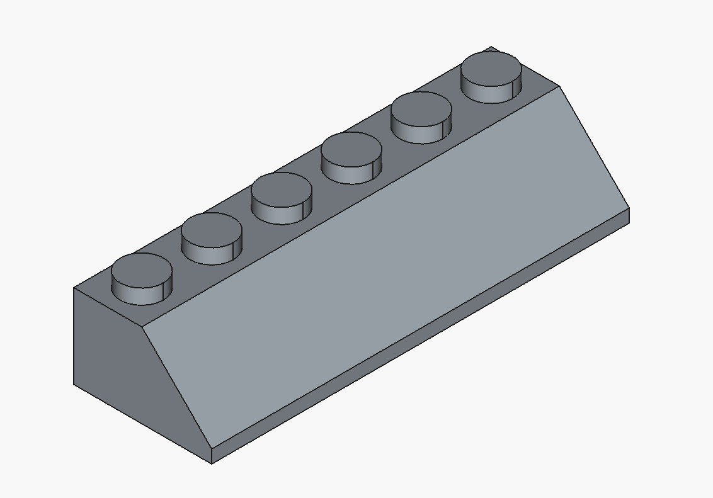
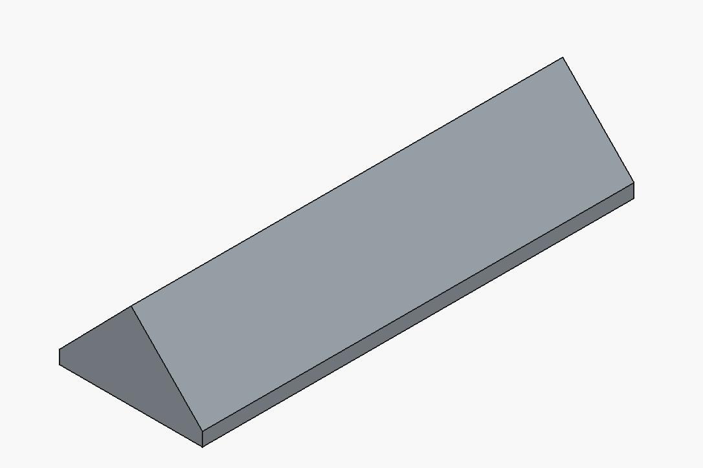
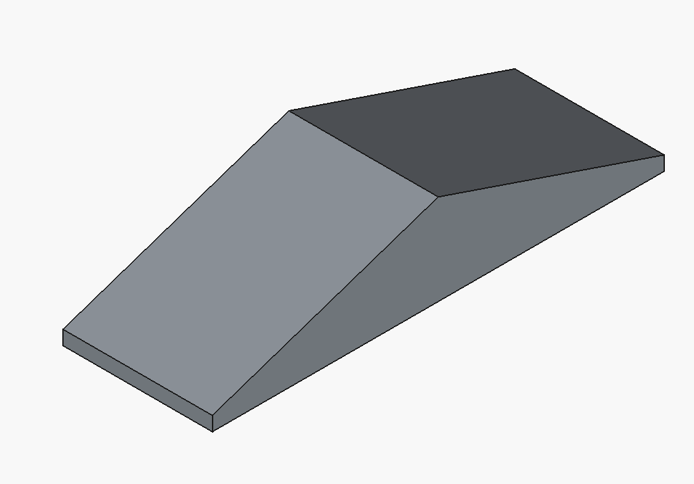
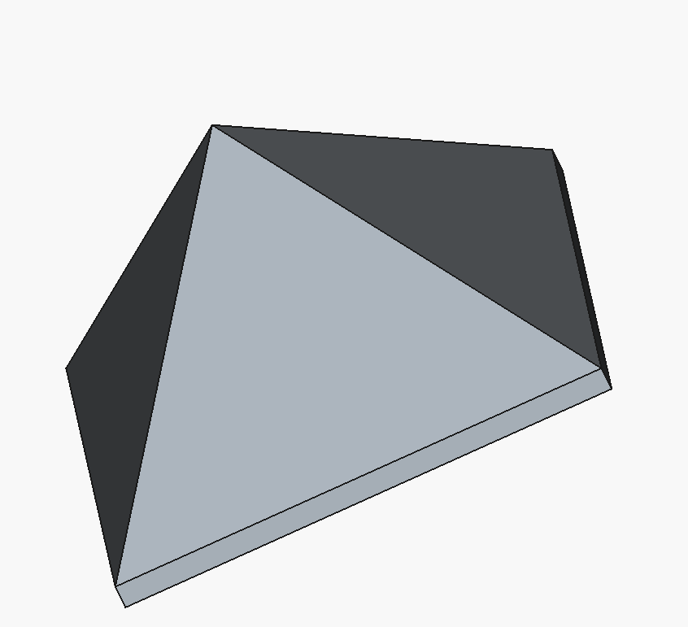

# FreeCAD LEGO® Brick als Bauteil
FreeCAD ist eine 3D CAD Software in der Version 1.0.2 
basierend auf der GNU LIBRARY GENERAL PUBLIC LICENSE

    meine Version 16.11.2025 mit der ich das Python script entwickelt habe.
    OS: Windows 11 build 26200
    Architecture: x86_64
    Version: 1.0.2.39319 (Git) Conda
    Build type: Release
    Branch: (HEAD detached at 1.0.2)
    Hash: 256fc7eff3379911ab5daf88e10182c509aa8052
    Python 3.11.13, Qt 5.15.15, Coin 4.0.3, Vtk 9.3.0, OCC 7.8.1
    Locale: German/Germany (de_DE)
    Stylesheet/Theme/QtStyle: FreeCAD Light.qss/FreeCAD Light/Fusion

## Python programme
Diese Python script basiert auf dem script slope_brick.py von Paul Cobbaut, 2023-05-18
https://github.com/paulcobbaut/FreeCAD-Brick

FreeCAD hat einen Part Designer mit dem man 3D Teile einwickeln kann.
Diese Script verwendet die funktionalitäten des PartDesigners.

Mit dem Script können Dachsteine (slope), Platen (plate) und LEGO® Steine (brick) erzeugt werden.
Meine Erweiterung ist nun den Type mit anzugeben.

    make_brick(2, 4, 3, 1, 'brick') # standard brick, bottom 2x4
    make_brick(2, 4, 3, 1, 'slope') # standard slope, bottom 2x4
    make_brick(4, 6, 1, 3, 'plate') # standard plate, bottom 2x6
    make_brick(4, 6, 1, 1, 'tile') # standard tile, bottom 2x6
    make_brick(2, 6, 3, 0, 'dslope') # dslope 2x6 
    make_brick(2, 6, 3, 0, 'qslope') # qslope 2x6 
    make_spire(2, 6, 3, 0, 'spire') # spire 2x6

Es können aber auch Dachsteine erstellt werden die es bei LEGO® nicht gibt.
make_brick(8, 2, 9, 2, 'slope')
## freecad-legify-macros
https://github.com/vectronic/freecad-legify-macros
Hier habe ich mir den Eingabe Dialog abgeschaut das Programm läuft bei mir auf einige Fehler. Standard Bircks klappen da super.
## Meine Anpassungen
BrickSlopePlateODialog.py verwendet die Datei 
BrickSlopePlateMitaLib.py ohne einen Dialog mit den oben angegeben Beispielen
FCDialog.py ist für eine Dialog eingabe.
BrickSlopePlateMDialog.py kann in FreeCAD geöffnet und gestarte werden und verwendet eine Dalog eingabe.
## Beispiel Steine

## Rechtlicher Hinweis
LEGO®
Die LEGO® Group ist Eigentümer der Marke LEGO® und wir respektieren deren Rechte an geistigem Eigentum.
Das Nachmachen der LEGO® Seine ist untersagt.
LEGO® is a registered trademark of the LEGO® Group, which does not sponsor, endorse, or authorize this site. Visit the official Lego® website at 
LEGO® ist eine eingetragene Marke der LEGO® Gruppe, die diese Website weder sponsert noch unterstützt oder autorisiert. Besuchen Sie die offizielle LEGO® Website unter
https://www.lego.com/de-de/legal/notices-and-policies/fair-play

